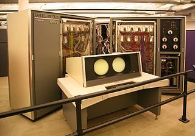
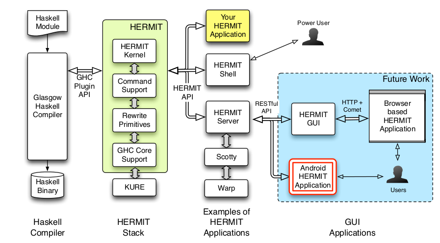
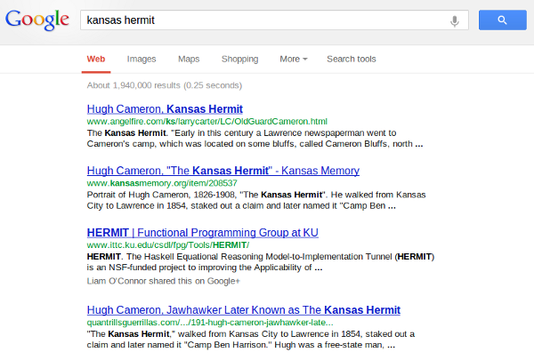
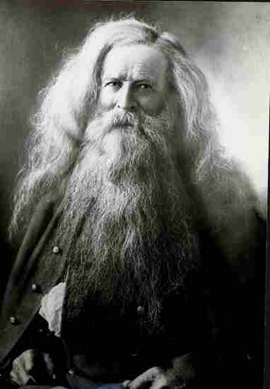
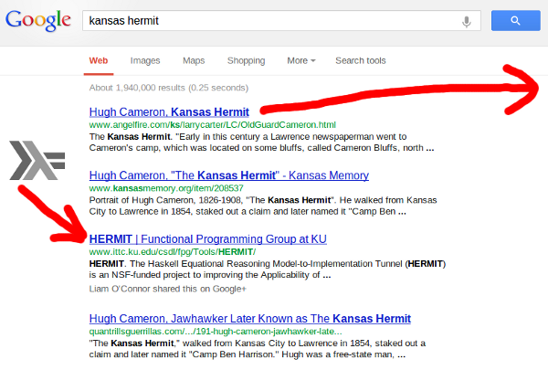
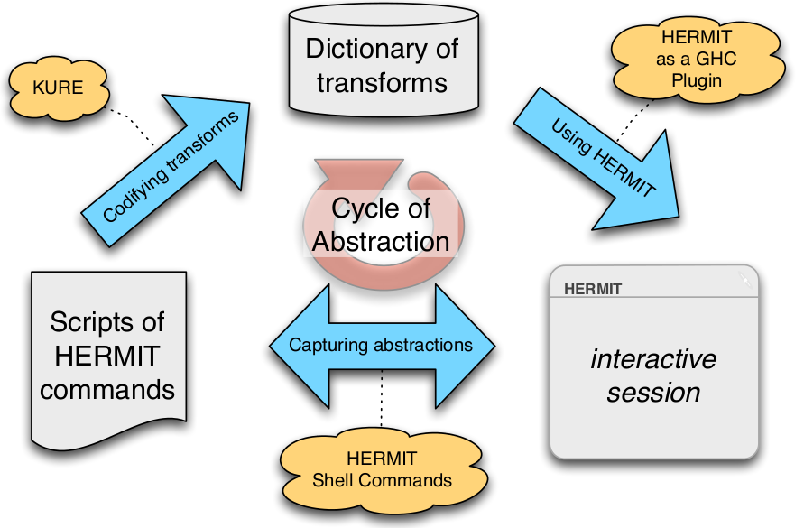
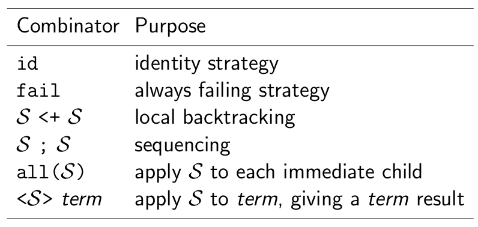
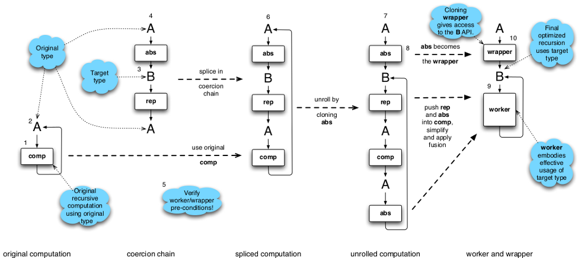
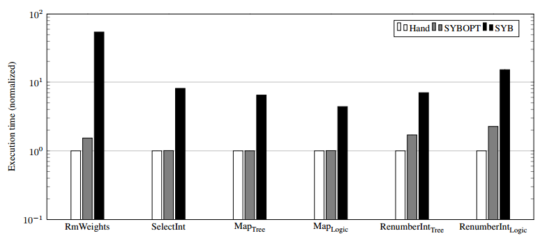

# How to Interact with a HERMIT

<p>
<small>
  Andy Gill<br/><br/>
  (joint work with Andy Gill, Ed Komp, Neil Sculthorpe, Robert Blair, Jan Bracker, Patrick Flor, Nick Frisby, Adam Howell, Ryan Scott, and Michael Tabone)
</small>
</p>
  
# Compilers in the 1950's


- Batch processor compiler

# Compilers in the 1960's



- Batch processor compiler

<i>http://en.wikipedia.org/wiki/CDC_6600</i>

# Compilers in the 1970's


- Batch processor compiler

# Compilers in the 1980's


- Batch processor compiler

<i>&copy; Bill Bertram, 2006</i>


# Compiler **are** Batch Processors

<BR>
  
- Compilers translate a computer language into something executable
- Many innovations (features supported)
- Optimization (Time, Space, Power)
- Just-in-Time - small black boxes

<BR>
  
<h3>So how **do** you interact with a compiler?</h3>
<BR>
<ul>
<li class="fragment">
Ask not what your favorite compiler can do for you,<BR>but what
you can do for your favorite compiler.
</li>

# Example: Unrolling Fibonacci

As a first example, let's transform the fib function by unrolling the recursive calls once.

```haskell
fib :: Int -> Int
fib n = if n < 2
           then 1
           else fib (n - 1) + fib (n - 2)
```

<pre class="fragment">What the compiler does<code class="haskell">fib :: Int -> Int
fib n = if n < 2
           then 1
           else (if (n - 1) < 2
                    then 1
                    else fib (n - 1 - 1) + fib (n - 1 - 2))
                +
                (if (n - 2) < 2
                    then 1
                    else fib (n - 2 - 1) + fib (n - 2 - 2))
</code></pre>

# Downloading and Running HERMIT

HERMIT requires GHC 7.6

1. <span style="font-family:monospace;">cabal update</span>
2. <span style="font-family:monospace;">cabal install hermit</span>
3. <span style="font-family:monospace;">hermit Fib.hs</span>

The hermit command just invokes GHC with some default flags:

```
% hermit Fib.hs
ghc Main.hs -fforce-recomp -O2 -dcore-lint
    -fsimple-list-literals -fexpose-all-unfoldings
    -fplugin=HERMIT
    -fplugin-opt=HERMIT:main:Main:
```


# First Example

```
import Criterion.Main

main = defaultMain [ bench "20" $ whnf fib 10]

fib :: Int -> Int
fib n = if n < 2
        then 1
        else fib (n - 1) + fib (n - 2)
```

```
% hermit Main.hs
...
module main:Main where
  fib ∷ Int -> Int
  main ∷ IO ()
  main ∷ IO ()
hermit<0> consider 'fib
fib = λ n → ...
...
hermit<1> any-call (inline 'fib)
fib = λ n → ...
hermit<2> resume 
%
```


# HERMIT

<div align="center">

</div>

# Help!


# ((Andrew's talk starts here))

<h3>A Plugin for Transforming GHC Core Language Programs</h3>
<p>
<small>
  Andrew Farmer<br/>afarmer@ittc.ku.edu<br/><br/>
  (joint work with Andrew Farmer, Neil Sculthorpe, Adam Howell, Robert Blair,
  Ryan Scott, Patrick Flor, and Michael Tabone)
</small>
</p>

#

- Bla

# Motivation

<ul>
<li class="fragment"> There is often a trade-off between the <span style="color:red;">clarity</span> and <span style="color:red;">efficiency</span> of a program.
<li class="fragment"> Useful to <span style="color:red;">transform</span> a clear program (specification) into an efficient program (implementation).
<li class="fragment"> We want to <span style="color:red;">mechanise</span> such transformations on Haskell programs:
    - less time-consuming and error prone than pen-and-paper reasoning
    - no need to modify the source file
<li class="fragment"> Several existing transformation systems for Haskell programs, e.g. HaRe, HERA, PATH, Ultra
<li class="fragment"> But they all operate on Haskell source code (or some variant).
<li class="fragment"> Haskell source code? Haskell 98? Haskell 2010? GHC-extended Haskell? Which extensions?
<li class="fragment"> Alternative: <span style="color:red;">GHC Core</span>, GHC’s intermediate language
</ul>

# Core

```haskell
data ModGuts  = ModGuts {_ :: [CoreBind], ...}
data CoreBind = NonRec Id CoreExpr
              | Rec [(Id, CoreExpr)]
data CoreExpr = Var Id
              | Lit Literal
              | App CoreExpr CoreExpr
              | Lam Id CoreExpr
              | Let CoreBind CoreExpr
              | Case CoreExpr Id Type [CoreAlt]
              | Cast CoreExpr Coercion
              | Tick (Tickish Id) CoreExpr
              | Type Type
              | Coercion Coercion
type CoreAlt  = (AltCon, [Id], CoreExpr)
data AltCon   = DataAlt DataCon | LitAlt Literal | DEFAULT
```

# What is HERMIT?

- <span style="color:red;">H</span>askell <span style="color:red;">E</span>quational <span style="color:red;">R</span>easoning <span style="color:red;">M</span>odel-to-<span style="color:red;">I</span>mplementation <span style="color:red;">T</span>unnel

# What is HERMIT?

<div style="float:left;">

</div>

# What is HERMIT?

<div style="float:left;">

</div>

<div style="float:left;">

</div>

<div style="clear: both; font-size: x-small;">
image from http://www.angelfire.com/ks/larrycarter/LC/OldGuardCameron.html
</div>

# What is HERMIT?

<div style="float:left;">

</div>

<div style="float:left;">

</div>

<div style="clear: both; font-size: x-small;">
image from http://www.angelfire.com/ks/larrycarter/LC/OldGuardCameron.html
</div>

# Demonstration: Unrolling Fibonacci

As a first demonstration, let's transform the fib function by unrolling the recursive calls once.

```haskell
fib :: Int -> Int
fib n = if n < 2
           then 1
           else fib (n - 1) + fib (n - 2)
```

# Demonstration: Unrolling Fibonacci

As a first demonstration, let's transform the fib function by unrolling the recursive calls once.

```haskell
fib :: Int -> Int
fib n = if n < 2
           then 1
           else fib (n - 1) + fib (n - 2)
```

```haskell
fib :: Int -> Int
fib n = if n < 2
           then 1
           else (if (n - 1) < 2
                    then 1
                    else fib (n - 1 - 1) + fib (n - 1 - 2))
                +
                (if (n - 2) < 2
                    then 1
                    else fib (n - 2 - 1) + fib (n - 2 - 2))
```

# HERMIT

<div align="center">

</div>

# HERMIT Commands

<div style="font-size: 0.75em;">
- Core-specific rewrites, e.g.
    - beta-reduce
    - eta-expand 'x
    - case-split 'x
    - inline
- Strategic traversal combinators (from KURE), e.g.
    - any-td r
    - repeat r
    - innermost r
- Navigation, e.g.
    - up, down, left, right, top
    - consider 'foo
    - 0, 1, 2, . . .
- Version control, e.g.
    - log
    - back, step
    - save "myscript.hss"
</div>

# Developing Transformations

<div align="center">

</div>

# Adding Transformations to HERMIT

Two main ways:

- Using KURE
    - very expressive
    - currently requires recompiling HERMIT
- Using GHC Rules
    - lightweight (can be included in the source code of the object program)
    - no need to recompile HERMIT
    - limited by the expressiveness of RULES

```haskell
{-# RULES "map/map"
    forall f g xs. map f (map g xs) = map (f . g) xs
#-}
```

# KURE

Consider the first case rewriting rule from the Haskell 98 Report.

```
case e of { alts } = (\v -> case v of { alts }) e
where v is a new variable
```

Writing a rule that expresses this syntactical rewrite is straightforward.

```haskell
rule_a :: ExpE -> Q ExpE
rule_a (CaseE e alts) = do
    v <- newName "v"
    return $ AppE (mkLamE [VarP v] $ CaseE (VarE v) alts) e
rule_a _              = fail "rule_a not applicable"
```

KURE is a DSL that allows the structured promotion of <span style="color:red;">locally acting</span> rules
into <span style="color:red;">globally acting</span> rules.

# Strategic Rewriting

<div align="center">

</div>

# Strategic Traversals

Try a rewrite, and if it fails, do nothing.

```
try(s) = s <+ id
```

Repeatedly apply a rewrite, until it fails.

```
repeat(s) = try(s ; repeat(s))
```

Apply a rewrite in a topdown manner.

```
topdown(s) = s ; all(topdown(s))
```

# Principal KURE Types

```haskell
data Translate c m a b = Translate { apply :: c -> a -> m b }

-- | A 'Translate' that shares the same source and target type.
type Rewrite c m a = Translate c m a a
```

<h3>The Category Zoo:</h3>

```haskell
instance Functor m           => Functor (Translate c m a)
instance Applicative m       => Applicative (Translate c m a)
instance Alternative m       => Alternative (Translate c m a)
instance Monad m             => Monad (Translate c m a)
instance MonadCatch m        => MonadCatch (Translate c m a)
instance MonadPlus m         => MonadPlus (Translate c m a)
instance Monad m             => Category (Translate c m)
instance MonadCatch m        => CategoryCatch (Translate c m)
instance Monad m             => Arrow (Translate c m)
instance MonadPlus m         => ArrowZero (Translate c m)
instance MonadPlus m         => ArrowPlus (Translate c m)
instance Monad m             => ArrowApply (Translate c m)
instance (Monad m, Monoid b) => Monoid (Translate c m a b)
```

# KURE in HERMIT

```haskell
-- HERMIT translations all operate over the same context and monad.
type TranslateH a b = Translate Context HermitM a b
type RewriteH   a   = Rewrite Context HermitM a

-- Context: bindings in scope, current ModGuts information
-- HermitM: fresh name supply, expression stash

betaReduce :: RewriteH CoreExpr
betaReduce = do App (Lam v e1) e2 <- idR
                return $ Let (NonRec v e2) e1
```

# Congruence Combinators

```haskell
-- | Translate an expression of the form: @Lam@ ’Id’ ’CoreExpr’
lamT :: TranslateH CoreExpr a
     -> (Id -> a -> b)
     -> TranslateH CoreExpr b
lamT t f =
    translate $ \ c e -> case e of
        Lam b e1 -> f b <$> apply t (addLambdaBinding b c @@ 0) e1
        _        -> fail "no match for Lam"
```

# Congruence Combinators in Action

```haskell
-- | (let v = ev in e) x ==> let v = ev in e x
letFloatApp :: RewriteH CoreExpr
letFloatApp =
  do vs <- appT letVarsT freeVarsT intersect
     let letAction = if null vs then idR else alphaLet
     appT letAction idR $ \ (Let bnds e) x -> Let bnds $ App e x
```

# Current Status

- A GHC plugin for interactive transformation of GHC Core programs
    - The HERMIT in the Machine (Haskell ’12) — describes the HERMIT implementation
    - The HERMIT in the Tree (IFL ’12) – describes our experiences mechanising existing program transformations
- Current Work
    - Worker/wrapper splitter
    - Extensibility
- Next step(s) 
    - Larger worker/wrapper examples
    - An equational reasoning framework 
    - Domain-specific optimization framework
    - Android interface

# Next: Worker/Wrapper

<div align="center">

</div>

Goal: scale up and automate!

# Next: Equational Reasoning Framework

- Support fold/unfold-style equational reasoning
    - The stash enables 'looking up the page'
    - Perform automatically while ensuring termination
- Enforce pre-conditions on transformations

```haskell
f (case x of p -> e)    ==>    case x of p -> f e

-- Only if f is strict!
```

- Create audit log of necessary conditions for verification

# Next: Domain-Specific Optimizations

- Optimizing SYB Is Easy! (<a href="http://michaeldadams.org/papers/syb-opt/">Submitted</a> to ICFP '13)

<div align="center">

</div>

- Stream Fusion (concatMap)
- Others?

# Wanted

- Users!
- Ideas!
- Use cases!

<br/>

<div style="width: 35%; margin: 0 auto;">
<span style="font-family:monospace;">cabal update</span><br/>
<span style="font-family:monospace;">cabal install hermit</span><br/>
<span style="font-family:monospace;">hermit Main.hs</span><br/>
<span style="font-size: x-small;">(HERMIT requires GHC 7.6)</span>
</div>

<br/>
<br/>
<br/>
<br/>

<div style="clear: both; font-size: small;">
These slides: <a href="http://www.ittc.ku.edu/~afarmer/galois-apr-13.html">http://www.ittc.ku.edu/~afarmer/galois-apr-13.html</a>
</div>

# &nbsp;

&nbsp;


