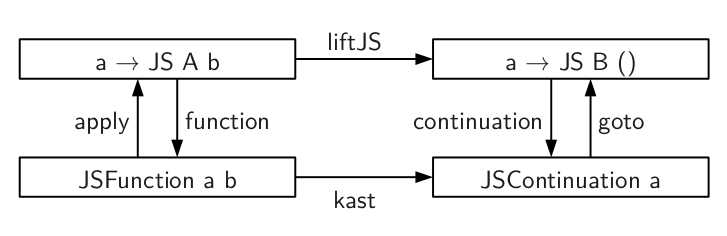
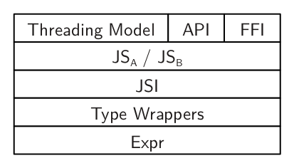
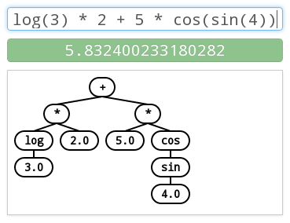
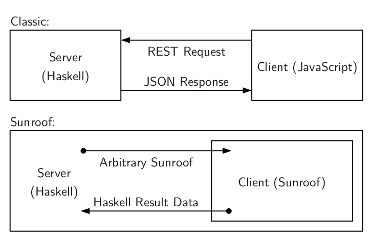

# Sunroof 
<h3>A Monadic DSL to Generate JavaScript</h3>
<p><small>15th May 2013</small></p>
<p>
  <small>Jan Bracker<sup>1,2</sup> and Andy Gill<sup>1</sup></small>
</p>
<p><small>
  <address>
    <sup>1</sup>
    ITTC / EECS<br />
    The University of Kansas<br />
    Lawrence, KS, 66045
  </address>
</small></p>
<p><small>
  <address>
    <sup>2</sup>
    Institut für Informatik<br />
    Christian-Albrechts-Universität<br />
    Kiel, Germany
  </address>
</small></p>

# Motivation

## Why JavaScript and Browsers?

<ul>
 <li class="fragment">Graphical canvases</li>
 <li class="fragment">Event handling</li>
 <li class="fragment">Available across platforms</li>
 <li class="fragment">Access through JavaScript</li>
</ul>

<p class="fragment">
We want to utilize the browser's capabilities!
</p>

## What is Sunroof?

<ul>
<li class="fragment">Deep embedding of JavaScript in Haskell</li>
<li class="fragment">Foreign Function Interface to JavaScript</li>
<li class="fragment">Platform for hybrid Haskell/JavaScript applications</li>
</ul>

# Example

```haskell
jsCode :: JS t ()
jsCode = do
    name <- prompt "Your name?"
    alert ("Your name: " <> name)
```

<div class="fragment">
Produces:

```javascript
var v0 = prompt("Your name?");
alert("Your name: " + v0);
```
</div>

<div class="fragment">
Types:

```haskell
prompt :: JSString -> JS t JSString
alert  :: JSString -> JS t ()
```
</div>

## JS-Monad

```haskell
jsCode :: JS t ()
jsCode = do
    name <- prompt "Your name?"
    alert ("Your name: " <> name)
```
 
 * Captures side-effects and imperative nature of JavaScript
 * Offers two threading models, specified by `t`
 * Bind becomes assigment in JavaScript

<div class="fragment">
*How do we constrain it to JavaScript types?*

 * Normalize monad through Operational
 * Allows us to constain involved types (Sculthorpe, 2013)
</div>

## Types and the Object Model

```haskell
prompt :: JSString -> JS t JSString
alert  :: JSString -> JS t ()
```

<div class="fragment">
 * We use Haskell to type check JavaScript
 * Hidden untyped expression language
   
```haskell
data Expr = Var Id | Apply Expr [Expr] | ...
```
</div>
 
<div class="fragment">
 * Types wrap expressions and implement `Sunroof` class
   
```haskell
class Sunroof a where
  box   :: Expr -> a
  unbox :: a -> Expr
```
</div>
 
<div class="fragment">
 * Allows new types to be added later (Svenningsson, 2012)
</div>

# Functions

```haskell
square :: JS t (JSFunction JSNumber JSNumber)
square = function $ \x -> return (x * x)
```

<div class="fragment">
```haskell
jsCode = do
  sqr <- square  -- Create / Bind
  n <- sqr $$ 2  -- Use
  alert $ cast n -- Output
```
</div>

<div class="fragment">
Types:

```haskell
function :: (...) => (a -> JS A r) 
                  -> JS t (JSFunction a r)
($$)     :: (...) => JSFunction a r 
                  -> a -> JS t r
```
</div>

## Functions

```haskell
square :: JS t (JSFunction JSNumber JSNumber)
square = function $ \x -> return (x * x)

jsCode = do
  sqr <- square  -- Create / Bind
  n <- sqr $$ 2  -- Application
  alert $ cast n -- Output
```

 * Functions are values in Haskell and JavaScript
 * Observable sharing makes creation a side-effect
 * Allows direct translation to JavaScript

## Continuations

 * Continuations needed for second threading model
 * `JS`-monad is a continuation monad (Claessen, 1999)

<div class="fragment">
*Sunroof embeds connection between both languages:*

</div>

# Threading Models

## Model A: Atomic
 * The JavaScript threading model
 * Callback centric
 * One thread with event loop

## Model B: Blocking

```haskell
jsCode = do
  
```

 * Adds cooperative concurrency to Sunroof
 * Offers abstractions known from Haskell: 
    * `forkJS` and `yield`
    * `MVar` and `Chan`
 * Implemented through translation of continuations to JavaScript

# Foreign Function Interface

<div class="fragment">
Inlining:

```javascript
document.getElementById("id")
```
</div>
<div class="fragment">
becomes:

```haskell
object "document" # invoke "getElementById" "id"
```

```haskell
object :: String -> JSObject
invoke :: (...) => String -> a -> o -> JS t r
(#)    :: o -> (o -> JS t r) -> JS t r
```
</div>

# Foreign Function Interface
<div class="fragment">
Creating a binding:

```haskell
alert :: JSString -> JS t ()
alert s = fun "alert" `apply` s
```

```haskell
fun :: (...) => String -> JSFunction a r
```
</div>

# Compiler



Statment Datetype is Target / Translation of Branches

Leave this away?


# Server

 * Allows to execute Sunroof code in the browser

```haskell
syncJS  :: ... -> JS t a  -> IO (ResultOf a)
asyncJS :: ... -> JS t () -> IO ()
```
 
 * Ability to interleave Haskell and JavaScript


# Case Study: A small calculator



## Case Study: Structure



## Case Study: TODO: REMOVE THIS?

Statistics + Downsides

# Conclusion

 * Write JavaScript in Haskell
 * Type-safety
 * Foreign-function interface
 * Excute JavaScript from Haskell
 * Generate JavaScript when needed

# References

TODO


