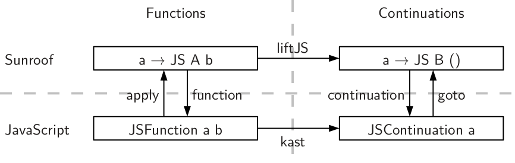

# Sunroof 
<h3>A monadic DSL to generate JavaScript</h3>
<p>
  <small>Jan Bracker<sup>1,2</sup> and Andy Gill<sup>1</sup></small>
</p>
<p><small>
  <address>
    <sup>1</sup>
    ITTC / EECS<br />
    The University of Kansas<br />
    Lawrence, KS, 66045
  </address>
</small></p>
<p><small>
  <address>
    <sup>2</sup>
    Institut für Informatik<br />
    Christian-Albrechts-Universität<br />
    Kiel, Germany
  </address>
</small></p>

# What is Sunroof?

 * Foreign Function Interface
 * Platform for hybrid Haskell/JavaScript applications


## Features

 * Types
 * Haskell-style (cooperative) concurrency
 * Simple, ready to use server


## Example

Example, show types

```haskell
jsCode :: JS t ()
jsCode = do
    name <- prompt "Your name?"
    alert ("Your name: " <> name)
```


## Structure


Figure: Structure of Sunroof


# JS-Monad

Problem / Solution


# Object Model

Expression type / Sunroof class / Table of Types / FFI


# Functions & Continuations



Signatures / callcc / Connection Figure


# Threading Models

Describe A / Describe B / Signature Primitives and MVar/Chan


# Compiler

Statment Datetype is Target / Translation of Branches


# Server

Interface / Short description


# Case Study


Calculator Image / Figure Structure / Statistics + Downsides


# Conclusion / Related Work / Acknowledgments

Conclude
Do we really need rel. work here?
Thanks to Conal Elliott.


